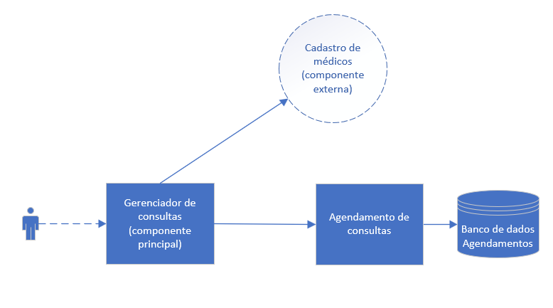

# Gerenciador de Consultas Médicas

## Descrição
O projeto consiste em um sistema de gerenciamento de consultas médicas. O sistema permite:
- Visualização de médicos cadastrados de uma determinada especialidade
- Visualização de horários disponíveis para um determinado médico
- Visualização de consultas marcadas para um determinado paciente
- Marcação de novas consultas
- Atualização de consultas existentes
- Exclusão de consultas

## Arquitetura
Além da componente principal, que é a API deste repositório, o sistema é composto por um microsserviço de agendamento de consultas, que é responsável pela persistência de as consultas marcadas, e também se comunica com uma API externa de cadastro de médicos. A comunicação entre os microsserviços é feita por meio de requisições HTTP REST.



## Execução com Docker

### Requisitos

1. Ter o [Docker](https://docs.docker.com/engine/install/) instalado
2. Adicionar um arquivo de nome `.env` na raiz do projeto com as seguintes variáveis de ambiente:
```
   API_KEY=<key-to-mockaroo>
```
Onde <key-to-mockaroo> é a chave para acessar a API do [Mockaroo](https://www.mockaroo.com/) contendo os dados fictícios de médicos.

### Execução - Opção 1: Executar somente esta API
1. A partir da pasta raiz em um terminal como administrador, executar o comando abaixo para criar a imagem do Docker:

   `docker build -t gerenciador-consultas .`
2. No mesmo terminal, executar o comando abaixo para executar o container:

   `docker run -p 5000:5000 gerenciador-consultas`

### Execução - Opção 2: Executar esta API juntamente com o microsserviço [agendamento-consultas](https://github.com/analuizasb2/agendamento-consultas)
1. A partir da pasta raiz do repositório [agendamento-consultas](https://github.com/analuizasb2/agendamento-consultas) um terminal como administrador, executar o comando abaixo para criar a imagem do Docker:

   `docker build -t agendamento-consultas .`
2. A partir da pasta raiz deste repositório em um terminal como administrador, executar o comando abaixo para criar a imagem do Docker:

   `docker build -t gerenciador-consultas .`

3. No mesmo terminal (deste repositório), executar o comando abaixo:

   `docker-compose up`

## Execução sem Docker

### Requisitos

1. Ter o Python 3 instalado na máquina
2. Executar o comando abaixo para instalar as dependências:

   `pip install -r requirements.txt`

3. Adicionar um arquivo de nome `.env` na raiz do projeto com as seguintes variáveis de ambiente:
```
   API_KEY=<key-to-mockaroo>
```
Onde <key-to-mockaroo> é a chave para acessar a API do [Mockaroo](https://www.mockaroo.com/) contendo os dados fictícios de médicos.

### Execução

Para executar a API, execute o comando abaixo a partir desta pasta:

`python -m flask run --port 5000`

